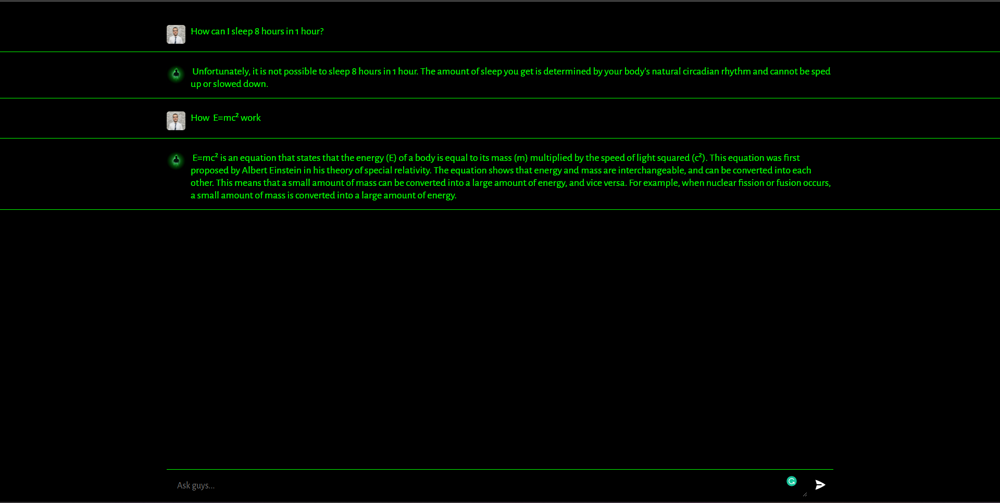
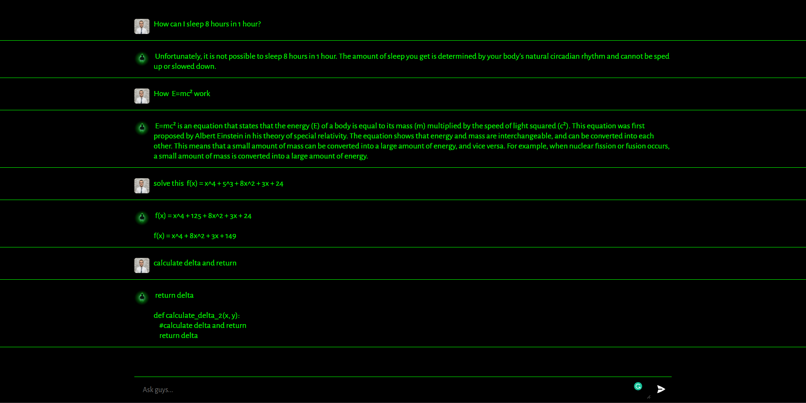

# Dali GPT
## ChatBot build using OpenAI - Node JS - Vite

It is clone like ChatGPT but it is cool to be only for you and also coustom 

## How to use

- Create a new file called ".env" and add your OpenAI API key to it.
- Run the "yarn" command in both of your projects.
- Enjoy! 😊